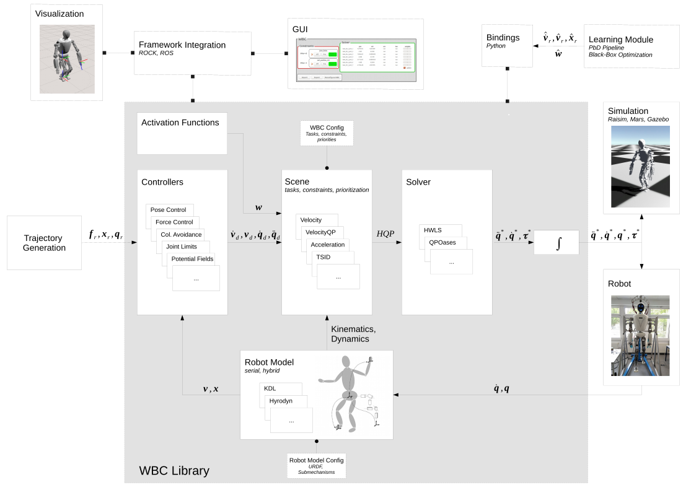

The design of the WBC library is inspired by the [iTaSC framework](https://orocos.org/itasc.html), which separates the whole-body controller into 4 building blocks, namely controllers(s), robot model, scene and solver. However, compared to iTaSC the WBC library described here is not coupled to any robotic framework (as in the iTaSC case - Orocos), but developed as a framework independent library. Also, it provides various robot models, solver and WBC implementations on velocity, acceleration and torque-level.

* **Controller**: A controller implements a task function in operational space, which represents the control objective of a single task, e.g., maintain a certain contact force, follow a trajectory or avoid an obstacle. Each controller can be designed either in task or joint space of the robot. Thus, depending on the implementation, the input of a controller can be a target pose, twist or wrench (task space), as well as a joint configuration, velocity or torque (joint space). The control output, which is passed to the scene, describes the error of the task function, which is minimized during task execution. All controllers are agnostic of the robot kinematics and dynamics, as well as the underlying \acrshort{wbcLabel} implementation. The available controllers can be found [here](https://github.com/ARC-OPT/wbc/tree/master/src/controllers).

* **Scene**: The scene sets up the optimization problem, which is implemented as a variant of a quadratic program (QP). The scene integrates all configured tasks/constraints and assigns them a priority. Depending on the implementation of the scene, the priorities can be strict, soft or a combination of both. Strict prioritization schemes implement a task hierarchy, where tasks with lower priority do not influence tasks with higher priority. In soft prioritization the solution is a weighted combination of all tasks, tasks with higher weights have a larger contribution to the solution. In each control cycle, the scene is updated with the current robot kinematics/dynamics and the control outputs of all tasks. The output of the scene is a (hierarchical) QP. The available scenes can be found [here](https://github.com/ARC-OPT/wbc/tree/master/src/scenes).

* **Robot Model**: The robot model computes the kinematic and dynamic information that the scene requires to set up the optimization problem. This includes different Jacobians and their derivatives, frame transformations, gravity forces and torques, as well as mass-inertia matrices. The robot model is updated in each control cycle with the current joint status (position, velocity, acceleration) of the robot. The available robot models can be found [here](https://github.com/ARC-OPT/wbc/tree/master/src/robot_models).

* **Solver**:  The solver is a generic component that solves a variant of a QP. The input is a (hierarchical) QP. Its output is a velocity, acceleration or torque command in configuration space of the robot. Note that not all solvers can cope with task hierarchies. The available robot models can be found [here](https://github.com/ARC-OPT/wbc/tree/master/src/solvers).
