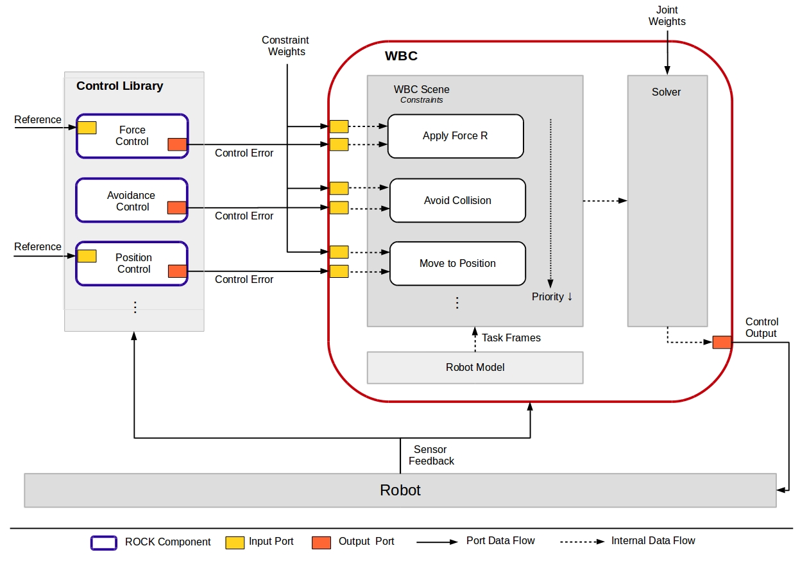

Although WBC can also be used for simple Cartesian position control, it is meant to be used in cases where a robot has to fulfill more than one task in parallel. The idea of the ROCK implementation of WBC is that each task is described by a controller and a corresponding constraint in WBC. Each controller regulates the task, while WBC merges the control output signals of all controllers into a coherent joint control signal for the robot that tries to fulfill all tasks if possible. Tasks can be assigned priorities to describe their importance in relation to other tasks.

The most important Rock components are

  * [Controllers](https://git.hb.dfki.de/dfki-control/wbc/orogen-ctrl_lib) Contains a collection of commonly used controllers:
    - Cartesian Position Controller
    - Joint Position Controller
    - Cartesian Radial Potential Fields (can be used for collision avoidance)
    - Joint Limit Avoidance
    - Cartesian Force Controller
    - ...

     Although it is recommended to use the control library, you can connect any other controller with the WBC component as long as it provides the correct control output (```base/samples/RigidBodyStateSE3``` for Cartesian controllers and ```base/commands/Joints``` for Joint space controllers). The controllers in the control library also provide a configurable  activation functions as output. This can later be connected with WBC to provide smooth activation and deactivation of certain tasks depending on the current control output.

  * [WBC](https://git.hb.dfki.de/dfki-control/wbc/orogen-wbc) Contains the actual WBC framework. This is composed of three modules: Robot model, Solver and WBC Scene. For performance reasons, these are integrated in one ROCK Task Context. However, on library level they are separated and it is straightforward to add, for example, new solvers or robot models.

  * (Optional) [WBC GUI](https://git.hb.dfki.de/dfki-control/wbc/gui-wbc_gui) contains a graphical interface for manipulating WBC parameters
